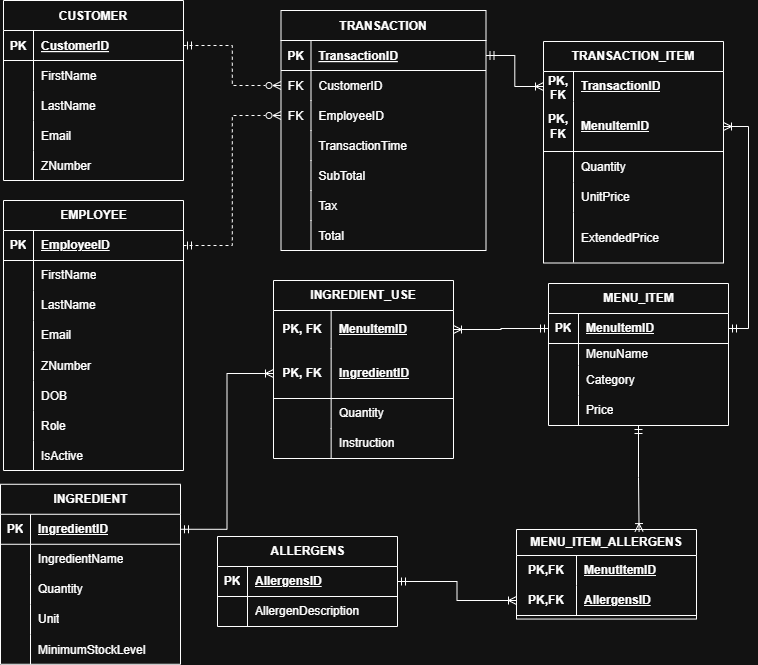

# Stockto-Dining

## Description

This is a group project contributed by four members (Cachary, Melvin, Tyler, Dylan) for CSCI 3222. The project revolves around establishing a database for a practical business.
Stockton Dining is the basis of the project, mainly to track inventory and menu items.
The goal of the project is to practice and showcase database management skills such as usage of SQL (Oracle), team communication, and relational database concepts.
